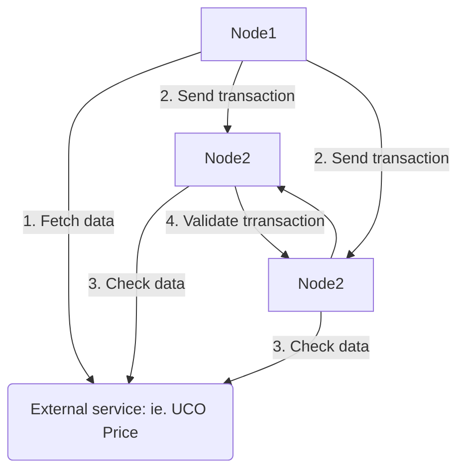

To enable a decentralized network to survive for the long term it must have the capability to adapt to threats and react accordingly. 
The network must require all the qualitative information to reconstruct any corrupt data.
In Arch Ethic Blockchain Oracle chains and Beacon chains support this feature.

While the Beacon chain lists all network states every 10mins and summarizes it every day Oracle supports Off-Chain communication through a dedicated transaction chain called `OracleChain`.

It aims to gather external data to be used inside the network or the smart contract layer.

## How is it work?

OracleChain behaves  like the [BeaconChain](/learn/sharding/beacon-chain) except the transaction on the chain are generated every 10min but only when there is a new data updated.

It's using a long-polling mechanism to get data from external sources and submit a transaction through ARCH Consensus.

 ARCH consensus ensures  atomic commitment of the data submitted as well as the validity of the information written into the transaction.

Each node received the new transaction from the OracleChain and can apply behaviors from this new data and notify smart contracts which depend on oracle updates.

## Services

The list of services supported by the OracleChain:

- UCO Price Feed: fetching UCO token price from Coingecko in USD/EUR currency and is used for the:
  - Transaction Fee algorithm
  - An auto reward of nodes that didn't receive enough mining rewards