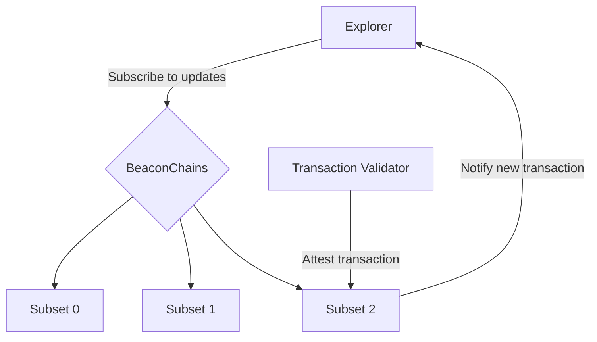

`Archethic` Blockchain leverages `Sharding` to outperform the exiting blockchains using shards called: `subsets` and BeaconChain Explorer displays the entire transactions across subsets. 
So, users can overcome the overhead of searching in each shard.

## Concepts
To better understand Beacon Chain Explorer one needs to first have an overview of the basic concepts below: 

### Slot

It is the time interval for a slot. We can explicitly give any time interval based on our testnet/mainnet environment.

A slot is responsible for a transaction being added to the Beacon Chain and shards. [See Slot](/learn/sharding/beacon-chain#slot)

### Epoch

It is a time interval within the Archethic network for the Beacon chain subsets.
One epoch may be having many slots based on a slot timer interval.
At each epoch, a new transaction is an emitter to have a summary of the entire epoch.

Epoch interval may differ between mainnet, testnet, or development. For instance, mainnet epoch interval is daily while testnet for now is each minute to ease the integration and simulation of the network.

So in this time interval beacon transactions are sealing the transaction in the current beacon summary transaction and replicating the transactions to other nodes.

### Subset
`Archethic` Blockchain has 256 subsets, from 00 to FF [0-255] (two nimbles) as the byte capacity and the first byte of the transaction.

## Process to get transaction notifications

Beacon Chain will store the transactions in slots and at the beacon summary time, all those transactions are summarized and will be replicated among the beacon storage nodes which are elected storage nodes.

Day 1 will be the next beacon summary date from the first node enrollment date, which means, that if the first node joins on `02/11/2021 10:00:00`, the beacon chain date to pull will be `03/11/2021 00:00:00`

The explorer exposes pagination based on a date since we can easily reproduce the addresses through a deterministic
address generation based on date.

So from `day 1` until now, we can offer pagination over the beacon summaries.

Because we can have a reproducible storage node election algorithm we can fetch data for a given date
for the right nodes.

## How to get transactions in realtime

When a client is displaying the beacon chain explorer, a request is sent to the BeaconChain subset in charge of the current slot, to subscribe to notifications about transaction replications.

On the BeaconChain, once a transaction is replicated a subset will enlist it for the next slot to be persisted.

Then we can notify subscribed clients (aka explorer nodes) of the transaction completion.

But because Archethic is using a rotating sharding implementation, the nodes involved for a given slot will change over time, therefore behind the scenes, the explorer will subscribe to each new slot to have the latest transactions in a soft real-time fashion.

