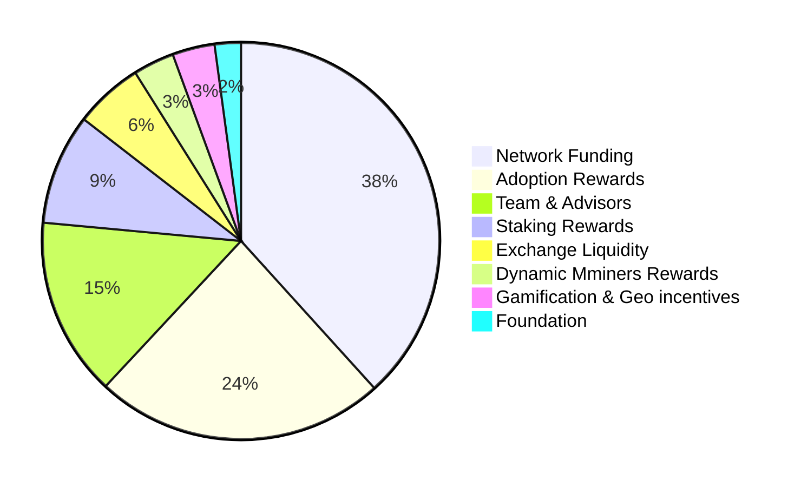

Arch Ethic, an open-source public blockchain is an infrastructure that is fuelled by its native cryptocurrency and should ideally scale to the sum of its individual nodes’ performance. It needs to be designed in such a way that it is a self-sustaining economy run by the people, for the people.

UCO is based on the principle of controlled supply and creating demand. 

## Fibonacci Golden Token Economics

Token distribution has been changed in order to achieve the goal of a self-sustaining crypto economy. 
Based on the collection of commissioned applications, the growth of transactions, users, and developers has been examined. 
To ensure that nodes are maintained, the cost of operating them has been calculated, and adoption and incentives have been developed.

 

